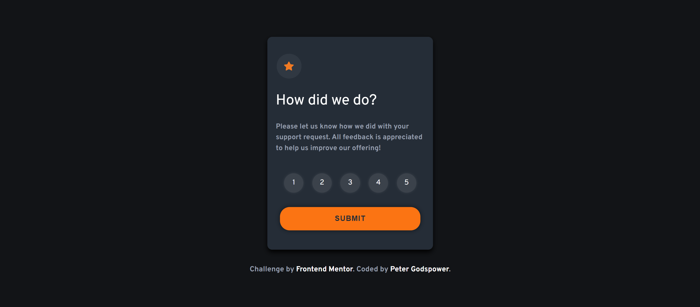
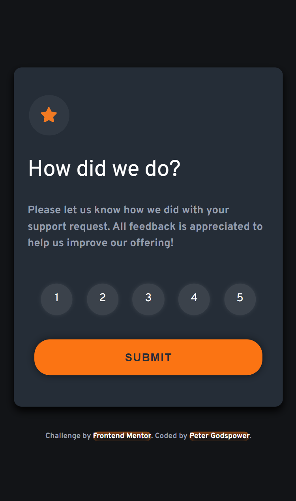

# Frontend Mentor | Interactive Rating Component

This is a solution to the Interactive Rating Component challenge on Frontend Mentor. The project involves creating a user-friendly rating component that allows users to select a rating and submit their feedback, with a thank-you message displayed upon submission.

## Table of Contents

- [Overview](#overview)
  - [Screenshot](#screenshot)
  - [Links](#links)
- [My Process](#my-process)
  - [Built With](#built-with)
  - [What I Learned](#what-i-learned)
  - [Continued Development](#continued-development)
  - [Useful Resources](#useful-resources)
- [Author](#author)
- [Acknowledgments](#acknowledgments)

## Overview

### Screenshot

### Links

- Solution URL: [Frontend Mentor Solution](https://www.frontendmentor.io/solutions/interactive-rating-component)
- Live Site URL: [Live Demo](https://your-live-site-url.com) <!-- Update with actual URL -->

## My Process

I approached this project by creating an interactive rating component that provides immediate feedback to users upon submission. The application features a rating selection process followed by a thank-you message.

### Built With

- **Semantic HTML5 Markup:** Structured the content using modern HTML elements for better readability and accessibility.
- **CSS Custom Properties:** Utilized CSS variables to maintain a consistent design and theming.
- **Flexbox:** Applied for layout management and responsive design.
- **Responsive Design:** Used `clamp()` and viewport-relative units to ensure fluid layouts across devices.
- **JavaScript:** Managed user interactions, dynamic updates, and state transitions.

### What I Learned

This project enhanced my skills in:

- **CSS Custom Properties:** Leveraging variables for consistent theming and easier updates.
- **Responsive Design:** Creating adaptable layouts using modern CSS methods.
- **JavaScript Interactivity:** Handling dynamic state changes, user input, and form submissions.
- **UI/UX Design:** Improving user experience through visual feedback and smooth transitions.

### Continued Development

Future improvements and projects will focus on:

- **Enhanced JavaScript Features:** Adding more interactive elements and improving data handling techniques.
- **Advanced CSS Styling:** Experimenting with advanced CSS animations and transitions.
- **Accessibility Improvements:** Ensuring the application is more accessible and user-friendly for a diverse audience.

### Useful Resources

- [MDN Web Docs](https://developer.mozilla.org/en-US/) - Comprehensive web development documentation.
- [CSS-Tricks](https://css-tricks.com/) - Articles and tutorials on modern CSS practices.
- [Frontend Mentor](https://www.frontendmentor.io/) - Platform for frontend challenges and community support.

## Author

- **Frontend Mentor:** [@YourProfile](https://www.frontendmentor.io/profile/YourProfile) <!-- Update with actual profile link -->
- **GitHub:** [YourGitHubUsername](https://github.com/YourGitHubUsername) <!-- Update with actual GitHub link -->

## Acknowledgments

Special thanks to Frontend Mentor for providing this engaging project and to the community for their valuable feedback and support.
